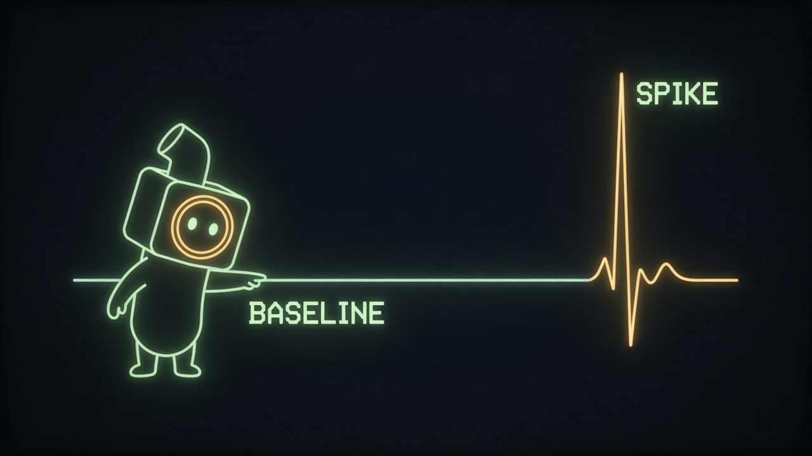
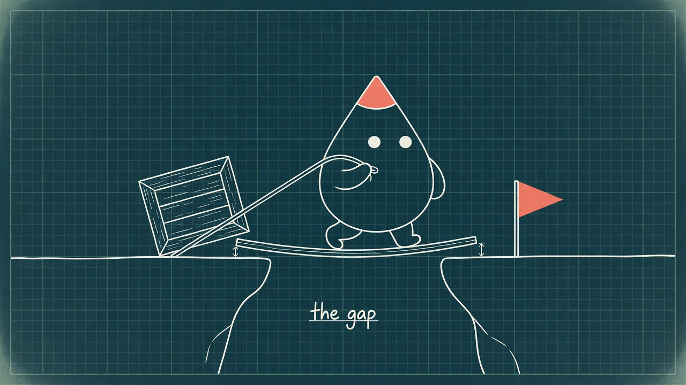

  

# illo skill

Generate original print-style **editorial illustrations** for articles and
blogs, starring a recurring mascot that performs each idea. Each character
pack carries one of ten bundled looks (riso, blueprint, woodcut, pixel, clay,
manila, chalk, phosphor, enamel, gouache) or a custom style — default
**Blot** (a deadpan ink-drop), or design your own with the built-in character
builder. One-metaphor-per-image scenes with named + custom + derived palettes
and reference-image character consistency. Renders through **three backends**:
your **Codex CLI** (gpt-image-2) or **Grok CLI** (xAI) on your subscription —
free for subscribers, no API key — when one is installed and logged in, or
**OpenRouter** (model-selectable: Grok Imagine, Nano Banana 2/Pro, GPT-5.4
Image 2, …) as the universal fallback. Grok can't make transparent cutouts;
those fall back automatically.

Hand it *"we replatform with zero downtime"* and you get the bridge being
rebuilt under live traffic:

> **🌐 [illo-skill.com](https://illo-skill.com)** — live examples, the
> character gallery, and copy-paste installs.

The skill itself lives in [`skills/illo/`](skills/illo/) — its
[README](skills/illo/README.md) is the full developer reference
(prerequisites, API-key setup, models & cost, everything below in detail).

Same idea, different voice — four of the ten bundled looks:

<table>
  <tr>
    <td></td>
    <td></td>
  </tr>
  <tr>
    <td align="center"><strong>riso</strong> — the house default</td>
    <td align="center"><strong>clay</strong> — stop-motion plasticine</td>
  </tr>
  <tr>
    <td></td>
    <td></td>
  </tr>
  <tr>
    <td align="center"><strong>phosphor</strong> — CRT trace on glass</td>
    <td align="center"><strong>blueprint</strong> — draftsman linework</td>
  </tr>
</table>

## Install

**Recommended: use your platform's native plugin or skill manager.** These
lanes install the same `illo` skill, but they preserve the runtime's managed
update path. Use the generic `npx skills` installer only when your runtime
doesn't have a native lane yet.

| Platform | Install | Update |
| --- | --- | --- |
| **Claude Code** | `/plugin marketplace add tmchow/illo-skill` then `/plugin install illo@illo-skill` | `claude plugin update illo`, or enable marketplace auto-update |
| **Codex** | `codex plugin marketplace add tmchow/illo-skill` then `codex plugin add illo@illo-skill` | `codex plugin marketplace upgrade` |
| **Grok** | `grok plugin marketplace add tmchow/illo-skill` then `grok plugin install tmchow/illo-skill --trust` | `grok plugin update illo` |
| **Gemini CLI** | `gemini extensions install https://github.com/tmchow/illo-skill` | `gemini extensions update illo` |
| **Copilot / GitHub CLI** | `gh skill install tmchow/illo-skill illo` (cross-agent via `--agent`) | `gh skill update illo` |
| **Hermes** | `hermes skills install tmchow/illo-skill/illo` | `hermes skills update illo` |
| **OpenClaw** | `openclaw skills install illo` | reinstall with the same command |
| **Cursor** | `npx skills add tmchow/illo-skill --skill illo` (Cursor Marketplace listing pending review) | re-run the installer |
| **Other agents / last resort** | `npx skills add tmchow/illo-skill --skill illo` | `npx skills update` |

Every lane installs the same skill; releases are tagged `v<version>` and
the version in every manifest is kept in lockstep with
`skills/illo/SKILL.md` by Release Please and CI.

## Repo layout

The skill sits in `skills/illo/`, following the layout of the canonical
skill repos (anthropics/skills, openai/skills): a top-level `skills/`
folder, one directory per skill. It is deliberately not at the repo root —
installers copy the entire skill directory verbatim, so the skill dir holds
only what every install should ship. Docs-only images live in
`_assets/illo/` (linked by raw URL), and repo meta stays at the root —
including the plugin manifests (`.claude-plugin/`, `.codex-plugin/`,
`.cursor-plugin/`, `.grok-plugin/`, `gemini-extension.json`) that make the
repo installable as a native plugin on each platform.

## Companion repos

- [tmchow/illo-characters](https://github.com/tmchow/illo-characters) —
  community character packs ("install the blip character").

## License

MIT © Trevin Chow — see [`LICENSE`](LICENSE) and
[`skills/illo/NOTICE`](skills/illo/NOTICE) for attribution of the Blot character and
bundled artwork.
