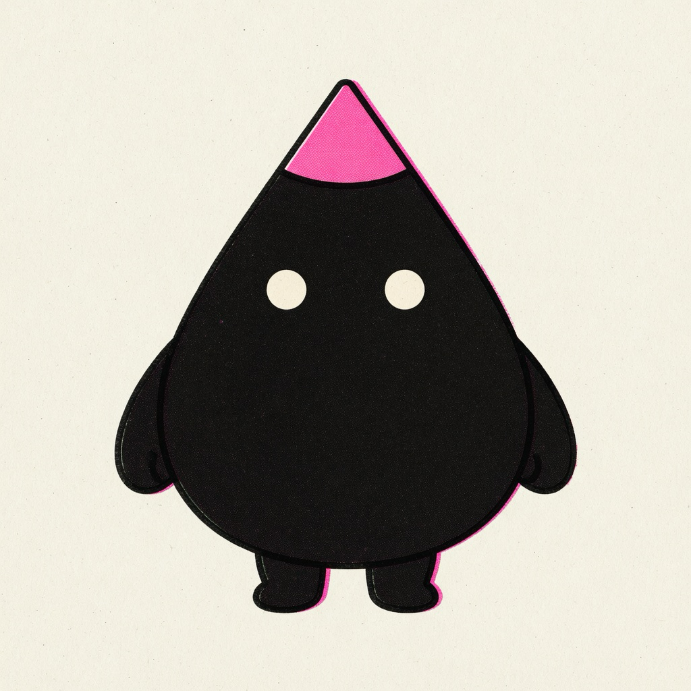
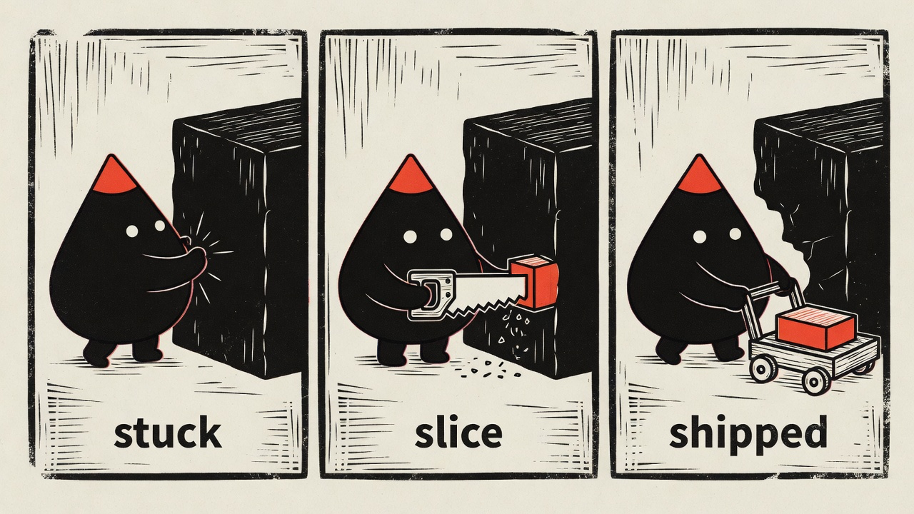
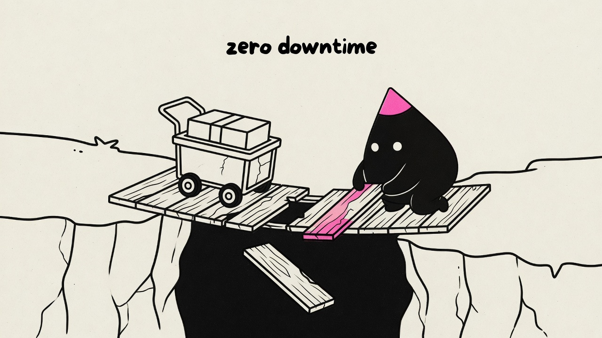

# Illo

Turn a concept or an article into original **editorial illustrations** —
flat, bold-lined print-style scenes where a recurring mascot performs the
idea. One image says one thing: a key judgment, a flow, a before/after, a
trap. It's a deliberate house style, not a generic image generator — closer
to a smart, deadpan print zine than to clip art or an infographic.

> **🌐 [illo-skill.com](https://illo-skill.com)** — the friendly tour: live
> examples, the character gallery, and copy-paste installs. This README is
> the developer reference; the site is the two-minute version.

The methodology is the constant; **the character pack and palette are yours
to set** — and every character pack carries its own print style. Out of the
box the mascot is **Blot**, a deadpan ink-drop in **risograph**. A built-in
**character builder** designs your own mascot with you (interview — including
picking its look from the bundled library of ten ([below](#looks)) — then
model-sheet candidates → pick → install). Want the same
character in another look? Build a *style variant pack* (`blot-woodcut`):
one pack, one look, so a catalog of characters never turns into a grid of
combinations. Palettes stay per-image and resolve by **destination**: a
character defines *where* its accent lives, never the color. One plain-text
line in your palettes file — `blog → notes` — and anything headed for your
blog automatically wears `notes`, a palette built once by copying your
site's real CSS colors into hexes (background → paper, text → ink, link
color → accent; re-extract only if you rebrand). Same mascot, fluoro pink
on X, your blog's exact orange on the blog — never asked twice. Or pick a
named preset, or hand it one brand color and let it derive the rest.



> **Invoking:** the skill answers to its name — say **"illo"** ("illo this
> post", "use illo: draw blip hauling a crate"). It deliberately won't hijack
> generic requests like "illustrate this post", and it can't know your
> installed characters' names up front — lead with "illo", then talk
> characters freely.

Same character, different voice — the bundled woodcut style telling a
three-panel story:



And the day job — compressing an abstract concept into one scene that lands
in about a second. Hand it *"we replatform with zero downtime"* and you get
the bridge being rebuilt under live traffic:



One idea per image, the mascot *performing* the move rather than decorating
it, at most three short hand-lettered labels — every render is held to that
bar, and off-model results get re-rolled before you see them.

## Looks

Every character pack picks exactly one look from the bundled library:

| Look | The voice |
|---|---|
| **riso** | Grainy halftone risograph — the house default |
| **blueprint** | White draftsman linework on deep blueprint blue |
| **woodcut** | Heavy carved relief print on warm cream |
| **pixel** | Chunky 4-color pixel art |
| **clay** | Matte stop-motion plasticine diorama |
| **manila** | Rubber-stamped ink on office manila paper |
| **chalk** | Dusty chalk on a deep slate board |
| **phosphor** | Glowing CRT trace on near-black glass |
| **enamel** | Hard-enamel pin cells with raised metal lines |
| **gouache** | Flat matte mid-century poster paint |

Looks are shared infrastructure, deliberately separate from characters: the
definitions live in this skill (`references/styles/`), and a character pack
just names one — so a fix to a look immediately improves every pack that
uses it, and adding a character never requires touching the skill. Want a
look that doesn't exist? Drop a custom style file in
`~/.config/illo/styles/<name>.md` and use it right away — and if it proves
out, PR it into the library here so packs everywhere can reference it.

## Prerequisites

- An **[OpenRouter](https://openrouter.ai) API key**. Images are generated by a
  small bundled script (`scripts/illo.py`) that calls OpenRouter's image API
  directly — no extra services or installs.
- **`python3`** (standard library only) and network access. macOS/Linux.
- The engine is **model-selectable** — see [Models & cost](#models--cost)
  below for the lineup and what to expect per image.

### Setting the key

Either export it, or bootstrap a config file once:

```bash
export OPENROUTER_API_KEY=sk-or-...           # option A: env var (preferred)

python3 scripts/illo.py init                  # option B: prompts for the key (hidden),
                                              # writes ~/.config/illo/config.yaml (mode 600)
python3 scripts/illo.py doctor                # check readiness
```

Key resolution is `--api-key` > `$OPENROUTER_API_KEY` > config file. The config
(a commented `config.yaml`) also holds non-secret defaults — `model`,
`defaultPalette`, `defaultCharacter`, `aspect`, and an optional `watermark`
map for attribution.
There is **no built-in watermark**; set your own so it's only ever yours:

```bash
python3 scripts/illo.py init --no-key \
  --watermark blog=yoursite.com --watermark x=@yourhandle
```

> The config file is read via **PyYAML** (`pip install pyyaml`) — needed only
> if you use a config file. Image generation itself needs no installs: it runs
> from `$OPENROUTER_API_KEY` + flags whether or not PyYAML is present.

## Models & cost

Generation is **pay-per-image through your OpenRouter account** — there's no
subscription in the skill itself. Typically **under ten cents per image**,
and a typical blog post (3–6 finals plus a few re-rolls) lands well under a
dollar on the default model. Prices are OpenRouter's and drift — check
[openrouter.ai/models](https://openrouter.ai/models) for current numbers.

| Model | Why you'd pick it | Relative cost |
|---|---|---|
| **Grok Imagine** — *default* | The recommendation comes from testing, not loyalty: boldest riso texture, the strongest character lock from the reference sheet, honors 16:9 — and the cheapest of the set. | $ |
| Nano Banana 2 | The dependable fallback: fast, the most reliable label text, publicly catalogued. | $ |
| Nano Banana Pro | Richest detail — worth it for hero images. | $$ |
| Microsoft MAI 2.5 | Clean look, lighter grain. | $$ |
| GPT-5.4 Image 2 | Strong instruction-following, but pricey and tends to return square regardless of the requested aspect. | $$$ |

Worth knowing:

- **The Grok default is API-reachable but not in OpenRouter's public model
  list** — it works for accounts with access. If a render 404s with "no
  endpoints found", the skill knows to fall back to Nano Banana 2.
- Any other OpenRouter **image-output** model works too — name it in the
  request ("use Nano Banana Pro for the hero") and the skill maps it. Ask
  for a model comparison and it renders the same prompt across models into
  a side-by-side gallery with per-image costs.

## Install

### Any agent (skills CLI)

```bash
npx skills add tmchow/agent-skills --skill illo
```

One command for Claude Code, Cursor, Codex, and the other runtimes the
[skills CLI](https://skills.sh) supports — it finds the skill in this repo
and asks which agents to install it into.

### Hermes

```bash
hermes skills install https://raw.githubusercontent.com/tmchow/agent-skills/main/illo/SKILL.md
```

From an interactive Hermes session:

```text
/skills install https://raw.githubusercontent.com/tmchow/agent-skills/main/illo/SKILL.md
/reload-skills
/skill illo
```

### OpenClaw

```bash
openclaw skills install illo
```

> ClawHub slug is provisional until first publish — update this line and the
> root catalog once the skill is published.

## Use it for

- **Article illustrations** — paste a post or doc; it finds the few
  load-bearing moments (never one image per paragraph), proposes a shot list,
  and produces a set you can interleave through the piece.
- **A single concept** — "illustrate *you are the bottleneck*" → one deadpan
  scene that lands one takeaway. If the idea is thin, it asks a couple of quick
  questions first instead of guessing.
- **Mini-comics** — a process, a before→after, a fail→fix told in 2–4 panels
  inside one image. The best shape when a sequence belongs together — and for
  social, where one self-contained image beats a thread.
- **Your own mascot** — the character builder interviews you (or starts from
  art you already have), pressure-tests the concept against the house
  guardrails, renders model-sheet candidates, and installs the winner as a
  named character pack in `~/.config/illo/characters/<name>/`. Keep several
  packs, set a default in the config, and switch per run by name ("use
  blot"). Every image stars the active character, kept on-model by a
  reference lock.
- **Community characters** — browse and install packs from
  [illo-characters](https://github.com/tmchow/illo-characters) ("install the
  blip character"); installs are pinned, and "update blip" pulls the repo's
  current version when you want it. Or publish your own: the skill opens a PR there with your
  model sheet and a scene render embedded for one-glance review. Companies
  can point `packsRepo` at a private pack repo instead.
- **Blog / brand-matched art** — `~/.config/illo/palettes.md` holds your own
  named palettes (the skill builds one for you by reading your site's CSS:
  background → paper, text → ink, link color → accent) plus plain-text
  destination lines like `blog → notes`. After that, blog posts wear your
  site's colors and X posts wear the bold house palette — same character,
  automatically. Or hand it one brand color and it derives a full palette
  around it.
- **Social-ready art** — bold house palette, square or wide, with your handle
  hand-lettered in as an optional watermark (from your config; never a built-in
  default).
- **Choosing between options** — render variations or run the same prompt
  across multiple models, then get a **self-contained comparison gallery**
  showing each image's model, cost, and prompt.

Throughout, the mascot stays on-model via a **reference lock**, every image is
self-checked against a quality bar (one idea per image, accent restraint, no
stray titles, fresh metaphor every time), and aspect ratios cover article
(16:9), social (1:1), and vertical formats.

## Notes

- This style is intentionally **not** photorealism, logos, UI mockups, charts,
  or generic stock art.
- Image models approximate exact colors; the skill eyedrops and re-rolls
  off-target palettes.

## License & credit

MIT © Trevin Chow. Illo — including the **Blot** default character and the
bundled example artwork — is original work; if you redistribute or build on
it, please keep attribution. See [`NOTICE`](NOTICE). Characters you create
with the character builder are, of course, yours.

---

`SKILL.md` is the agent-facing instructions — you don't need to read it to use
the skill.
